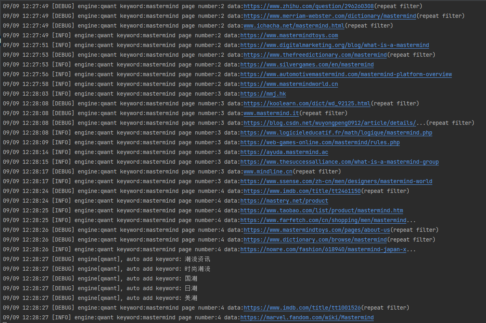

# 中秋特贡 [免费版]

## 一、MSRAY简介

Msray，可根据指定的关键词，自动从多个搜索引擎获取搜索结果数据(并发), 并且支持自动去重复、自定义代理、webhook推送等。

不仅仅是url采集！支持存储域名、网址(url)、标题、描述、结果来源的搜索引擎名称、IP地址、服务器所属国家等多种信息！

msray是从msray-plus商业版中提取出来的精简版本,可免费使用无功能限制。喜欢的给个赞(start)哦！


## 二、运行效果

### 1. 谷歌引擎(google)


### 2. 法国引擎(QWANT)



### 3. 必应引擎(bning)


### 4. 俄罗斯引擎(yandex)


## 三、程序优势

1. 支持国外与国内多个主流搜索引擎，每个引擎的参数可单独控制；
2. 可自动检测当前网络是否需要翻墙，用于部分国外引擎的初始网络代理设定判断。
3. 无需特定环境与依赖，可直接运行;
4. 自动去重过滤；
6. 支持webhook，采集的结果，可实时推送到自定义远程API接口；
7. CPU占用、内存资源占用低；
8. 跨平台，同时支持windows各主流版本操作系统、以及Centos、Ubuntu、Mac等各版本操作系统；
9. 支持自定义保存数据字段（域名、网址、所属引擎、标题、描述、IP、访问状态码等）
10. 支持自定义代理功能，同时支持本地txt载入代理，以及支持代理平台API接口，可自定义自动更新时间频率；

下一版本新增多种过滤参数控制功能！域名后缀过滤、标题关键词过滤、域名级别过滤；


## 四、目前支持的搜索引擎列表

1. 必应搜索引擎
2. Google搜索引擎
3. Yandex搜索引擎
4. Qwant搜索引擎


## 五、 配置文件说明

配置文件路径： config.yaml

```
system:
  logLevel: debug           # 日志级别 建议debug或info
  repeatCheckType: domain   # 重复过滤类型 域名=domain 网址=url

result:
  saveField:          # 需要存储的字段
    engine: true	  # 存储使用的搜索引擎别名，如:bing | baidu | qwant
    domain: true	  # 存储域名
    url: true		  # 存储URL
    title: true		  # 存储标题
    description: false # 存储描述
    ip: true		   # 存储IP	
    country: false	   # 存储服务器所属国家
    httpStatus: false  #状态码
  timeout: 10         # 获取数据的网络请求超时时间

engine:	 # 搜索引擎配置  比如：bing=必应
  bing:	 
    status: false	# 是否开启
    delay: 1		# 每页采集后的延迟时间
    page: 1			# 每个关键词采集的页数
    language:
    timeout: 10		# 请求超时时间
  yandex:
    status: false
    delay: 10
    page: 5
    language:
    timeout: 10
  qwant:
    status: false
    delay: 1
    page: 8
    language:
    timeout: 10
  google:
    status: true
    delay: 3
    page: 8
    language:
    timeout: 10
  baidu:
    status: false
    delay: 1
    page: 8
    language:
    timeout: 10

webhook:
  status: false                   # 是否开启推送
  url: http://127.0.0.1/receive   # 接收推送数据的地址

proxy:
  status: true           # 是否启动代理功能
  local:
    path: data/proxy.txt  # 文件路径
    isCommon: 1           # 线路类型 国外线路=1 国内线路2
  api:
    url:                  # 访问地址
    intervalTime: 10      # 自动更新时间(秒)
    protocolType: http    # 协议类型,如http/socks4
    isCommon: 1           # 线路类型 国外线路=1 国内线路2


```


## 六、 运行说明

```
mstay.exe search -k 关键词

如：
mstay.exe search -k msray
```

采集完成后, 会在result目录下生成结果文件(每个关键词单独一个文件), 一行一个采集结果。

注意：重复关键词采集，会自动清空上次采集的内容；


## 七、 技巧分享

借助webhook功能，你可以实现很多拓展与自定义功能哦！比如自动把搜索结果中的网站域名，存储到自己的数据库，又或者联动fofa、xray、goby、nessus等等软件实现安全漏扫扫描与检查。


## 八、 其他

不接定制开发，时间精力有限。

如需更多功能请查看商业版本(Msray-Plus) 商业版在线文档：http://www.msray.net/doc


