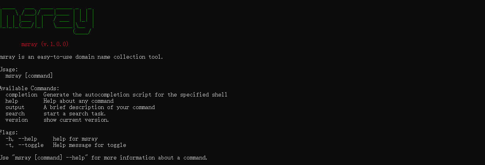
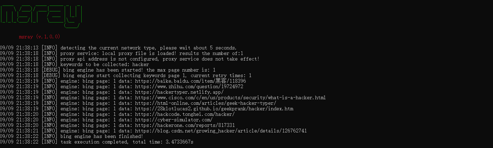
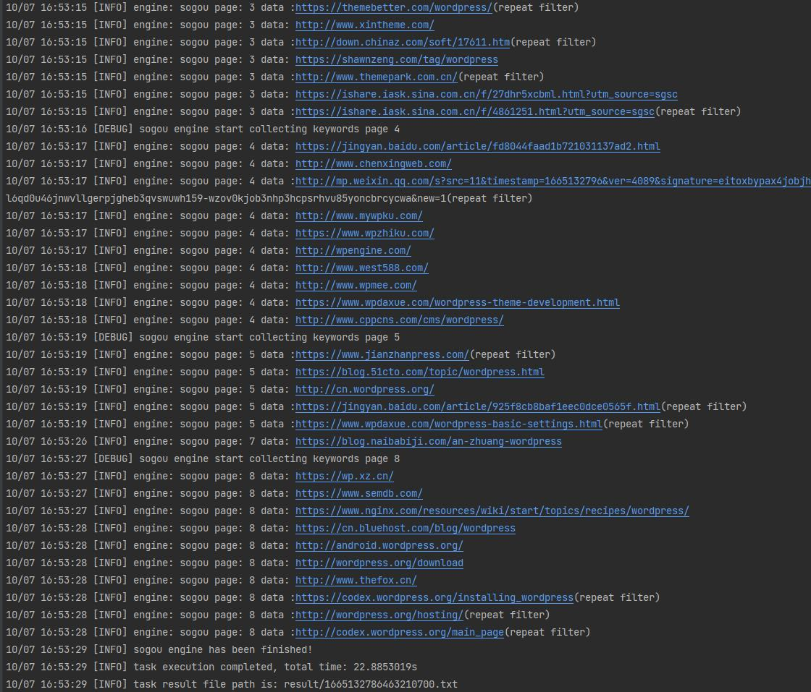

以前发布了基于python的开源版本，名字叫[superl-url](https://github.com/super-l/superl-url)，被很多平台和小伙伴转载发布，但是后期实在是没时间维护，升级的事情一直搁置了。 

时隔四五年，这次使用GO语言重新设计与开发了，彻底摆脱python环境与依赖问题，并且资源占用更少，代码质量更高(非随手写的)，也支持跨平台运行！


更新日志： [更新日志](update.md)


## 一、MSRAY简介


Msray是一款聚合搜索引擎结果采集软件。 可根据指定的关键词，自动从多个搜索引擎获取搜索结果数据(并发采集), 并且支持自动去重复、智能代理轮询、采集结果webhook推送等。


不仅仅是url采集！支持存储域名、网址(url)、标题、描述、结果来源的搜索引擎名称、IP地址、服务器所属国家等多种信息！

msray是从msray-plus商业版中提取出来的搜索引擎模块的精简版本, 可免费使用无功能限制。

喜欢的给个赞(start)哦！点赞是分享的动力。


## 二、程序优势

1. 支持国外与国内多个主流搜索引擎，每个引擎的参数可单独控制；
2. 可自动检测当前网络是否需要翻墙，用于部分国外引擎的初始网络代理设定判断。
3. 基于Go语言特性，无需特定环境与依赖，可直接运行;
4. 自动去重过滤。同时支持按url模式或者域名模式进行重复判断；
6. 支持webhook，采集的结果，可实时推送到自定义远程API接口；
7. CPU占用、内存资源占用低；
8. 跨平台，同时支持windows各主流版本操作系统、以及Centos、Ubuntu、Mac等各版本操作系统；
9. 支持自定义保存数据字段（域名、网址、所属引擎、标题、描述、IP、访问状态码等）
10. 支持自定义代理功能，同时支持本地txt载入代理，以及支持代理平台API接口，可自定义自动更新时间频率；


## 三、目前支持的搜索引擎列表

1. 必应搜索引擎
2. Google搜索引擎
3. Yandex搜索引擎
4. Qwant搜索引擎
5. 搜狗引擎


## 四、运行效果

### 0. 运行效果




### 1. 谷歌引擎(google)


### 2. 法国引擎(QWANT)


### 3. 必应引擎(bning)



### 4. 俄罗斯引擎(yandex)


### 5. 搜狗引擎(yandex)



## 五、 配置文件说明

配置文件路径： config.yaml

```
system:
  logLevel: debug           # 日志级别 建议debug或info
  repeatCheckType: domain   # 重复过滤类型 域名=domain 网址=url

result:
  saveField:          # 需要存储的字段
    engine: true	  # 存储使用的搜索引擎别名，如:bing | baidu | qwant
    domain: true	  # 存储域名
    url: true		  # 存储URL
    title: true		  # 存储标题
    description: false # 存储描述
    ip: true		   # 存储IP	
    country: false	   # 存储服务器所属国家
    httpStatus: false  #状态码
  timeout: 10         # 获取数据的网络请求超时时间

engine:	 # 搜索引擎配置  比如：bing=必应
  bing:	 
    status: false	# 是否开启
    delay: 1		# 每页采集后的延迟时间
    page: 1			# 每个关键词采集的页数
    language:
    timeout: 10		# 请求超时时间
  yandex:
    status: false
    delay: 10
    page: 5
    language:
    timeout: 10
  qwant:
    status: false
    delay: 1
    page: 8
    language:
    timeout: 10
  google:
    status: true
    delay: 3
    page: 8
    language:
    timeout: 10
  baidu:
    status: false
    delay: 1
    page: 8
    language:
    timeout: 10

webhook:
  status: false                   # 是否开启推送
  url: http://127.0.0.1/receive   # 接收推送数据的地址

proxy:
  status: true           # 是否启动代理功能
  local:
    path: data/proxy.txt  # 文件路径
  api:
    url:                  # 访问地址
    intervalTime: 10      # 自动更新时间(秒)
    protocolType: http    # 协议类型,如http/socks4

```


## 六、 运行说明

```
msray.exe search -k 关键词

如：
msray.exe search -k msray
```

采集完成后, 会在result目录下生成结果文件, 一行一个采集结果(因为存储的结果不仅仅是URL，还可以包括标题、描述、IP等信息，所以采用json格式存储)。

每次采集的结果文件路径，都会在命令行任务执行完成后显示!(文件名是采用当前时间戳)


## 七、关于代理配置说明

### 1. 本地txt代理

本地代理数据文件默认路径为：data/proxy.txt
如果需要使用到代理，则把有效的代理数据，按行粘贴到该文件中即可！注意，需要带上代理协议，如果不指定代理协议，则自动添加http协议。

正确格式如： 
```
sock4://x.x.x.x:22222
sock5://x.x.x.x:1111
http://x.x.x.x:8888
```

注意：

```
x.x.x.x:8888  等于 http://x.x.x.x:8888
```


### 2. 代理API接口

有些小伙伴购买的有代理接口，则可以把接口地址复制，粘贴设置到config.yaml的proxy.api.url节点。

```

接口返回数据内容，一般是按行显示代理数据。 格式如：

x.x.x.x:1888
x.x.x.x:2888
x.x.x.x:3888


一般不带有协议名，所以需要同时配置proxy.api.protocolType参数的类型。

如果返回的数据中，带有协议名，程序也会智能判断，优先使用。对于存在协议名的数据，不会使用proxy.api.protocolType参数的配置值。
```


## 八、下载地址


查看项目的release: https://github.com/super-l/msray/releases/

如果需要linux或者mac版本，可加群像群主索要！ 

比较懒，如果没有人需要linux或者mac版本，每次默认是不编译除windows外的其他版本的~~


## 九、 技巧分享

借助webhook功能，你可以实现很多拓展与自定义功能哦！

比如自动把搜索结果中的网站域名，存储到自己的数据库，又或者联动fofa、xray、goby、nessus等等软件实现安全漏扫扫描与检查。


## 十、 技术交流与探讨、资料分享


网络安全技术交流群(QQ)：235586685

网络安全技术交流群交流群(Telegram)： https://t.me/sec_nst


## 十一、 其他

不接定制开发，时间精力有限。

我们不卖代理，也没有代理数据卖，需要用户自行寻找。

如需更多功能请查看商业版本(Msray-Plus) 商业版在线文档：http://www.msray.net/doc
